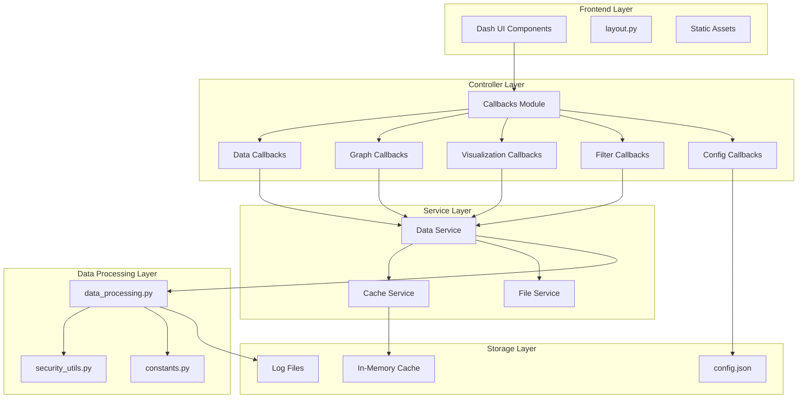
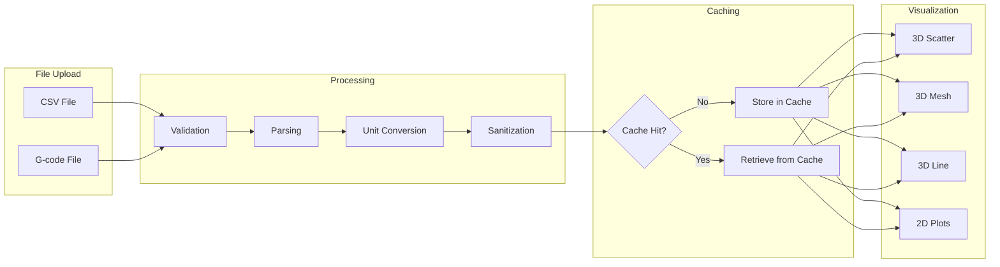
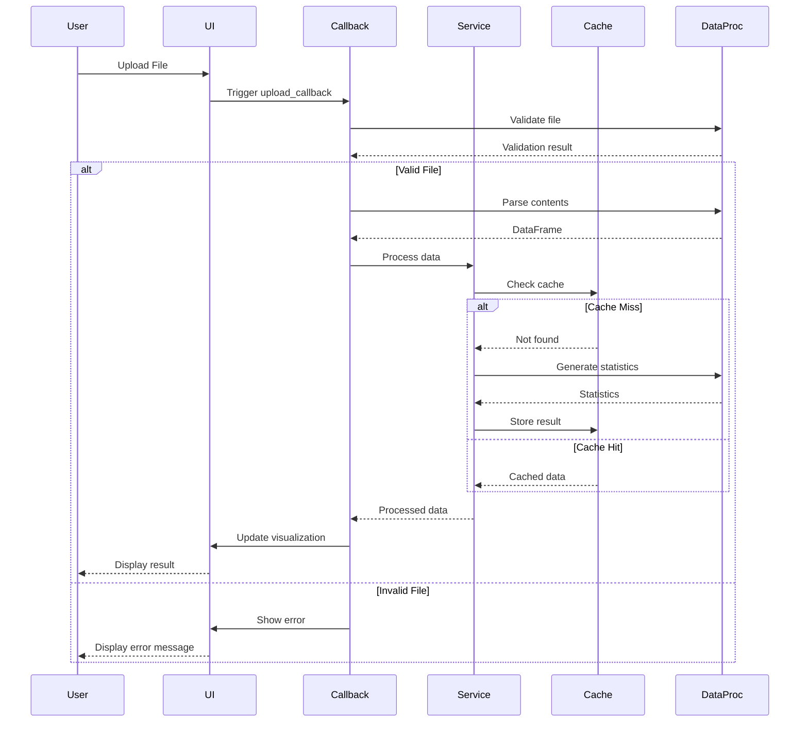
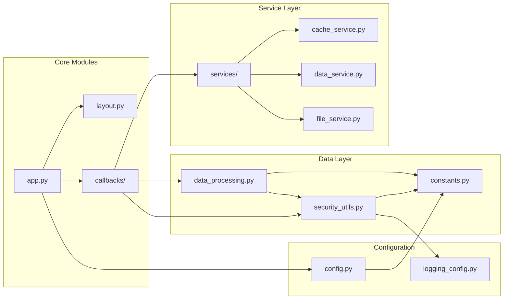
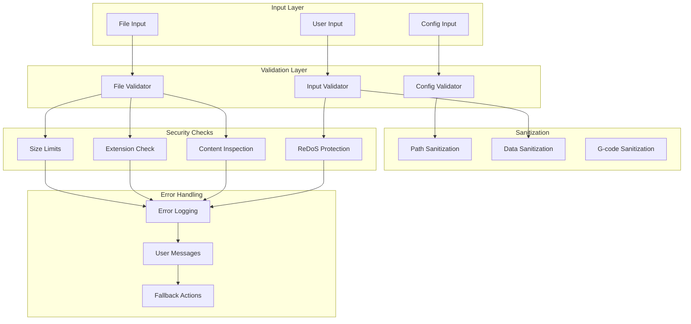
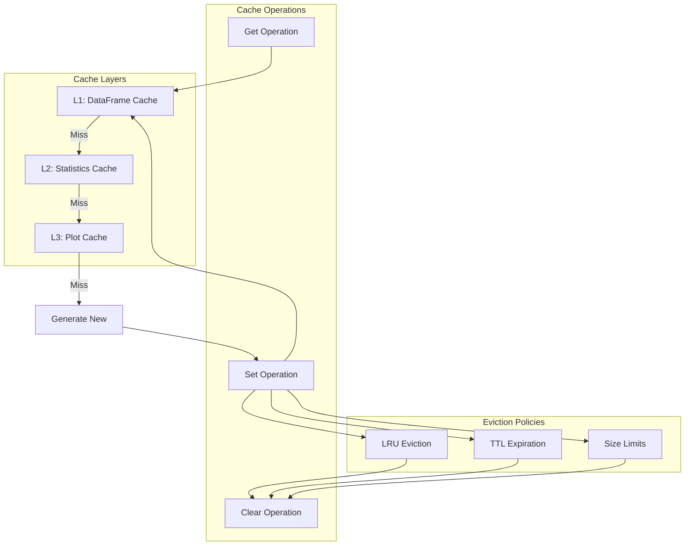
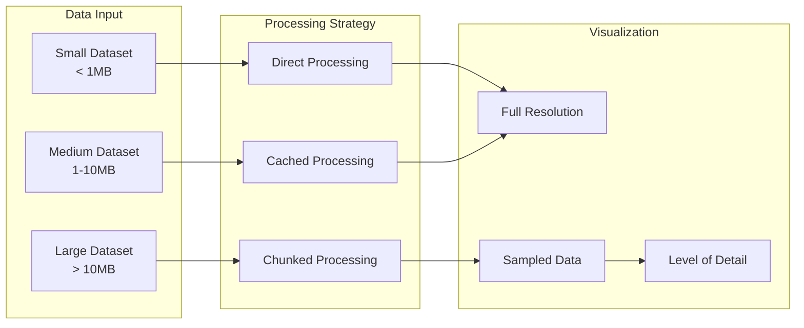
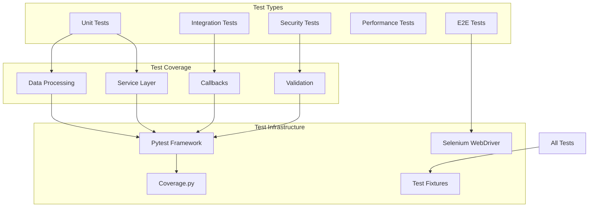
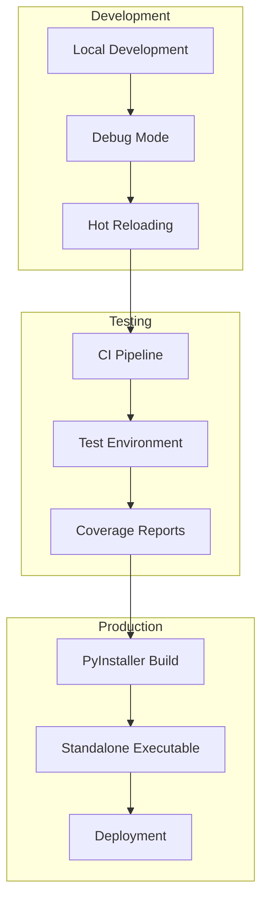

# MELD Visualizer Architecture Documentation

## System Architecture

## Data Flow Diagram

## Component Interaction Diagram

## Module Dependencies

## Security Architecture

## Caching Strategy

## Performance Optimization Flow

## Testing Architecture

## Deployment Architecture

