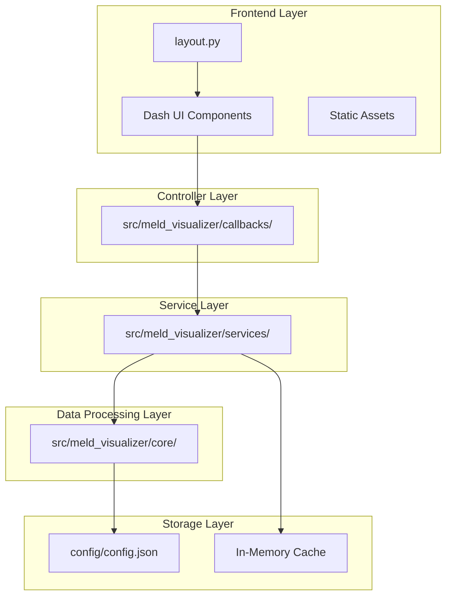
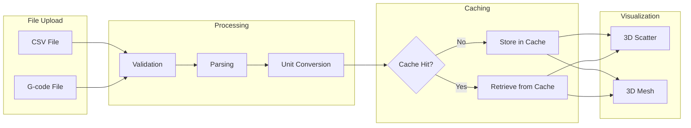

# MELD Visualizer Architecture

## System Architecture

```mermaid
graph TB
    subgraph "Frontend Layer"
        UI[Dash UI Components]
        Layout[layout.py]
        Assets[Static Assets]
    end

    subgraph "Controller Layer"
        Callbacks[src/meld_visualizer/callbacks/]
    end

    subgraph "Service Layer"
        Services[src/meld_visualizer/services/]
    end

    subgraph "Data Processing Layer"
        DataProcessing[src/meld_visualizer/core/]
    end

    subgraph "Storage Layer"
        Config[config/config.json]
        Cache[In-Memory Cache]
    end

    UI --> Callbacks
    Layout --> UI
    Callbacks --> Services
    Services --> DataProcessing
    Services --> Cache
    DataProcessing --> Config
```

## Data Flow

```mermaid
flowchart LR
    subgraph "File Upload"
        CSV[CSV File]
        GCode[G-code File]
    end

    subgraph "Processing"
        Validation[Validation]
        Parsing[Parsing]
        Conversion[Unit Conversion]
    end

    subgraph "Caching"
        CacheCheck{Cache Hit?}
        Store[Store in Cache]
        Retrieve[Retrieve from Cache]
    end

    subgraph "Visualization"
        Scatter[3D Scatter]
        Mesh[3D Mesh]
    end

    CSV --> Validation
    GCode --> Validation
    Validation --> Parsing
    Parsing --> Conversion
    Conversion --> CacheCheck

    CacheCheck -->|No| Store
    CacheCheck -->|Yes| Retrieve

    Store --> Scatter
    Store --> Mesh

    Retrieve --> Scatter
    Retrieve --> Mesh
```
