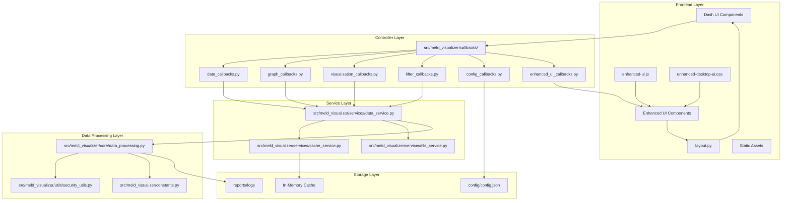
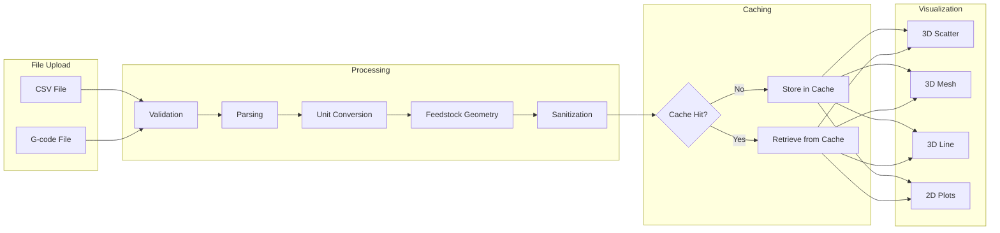
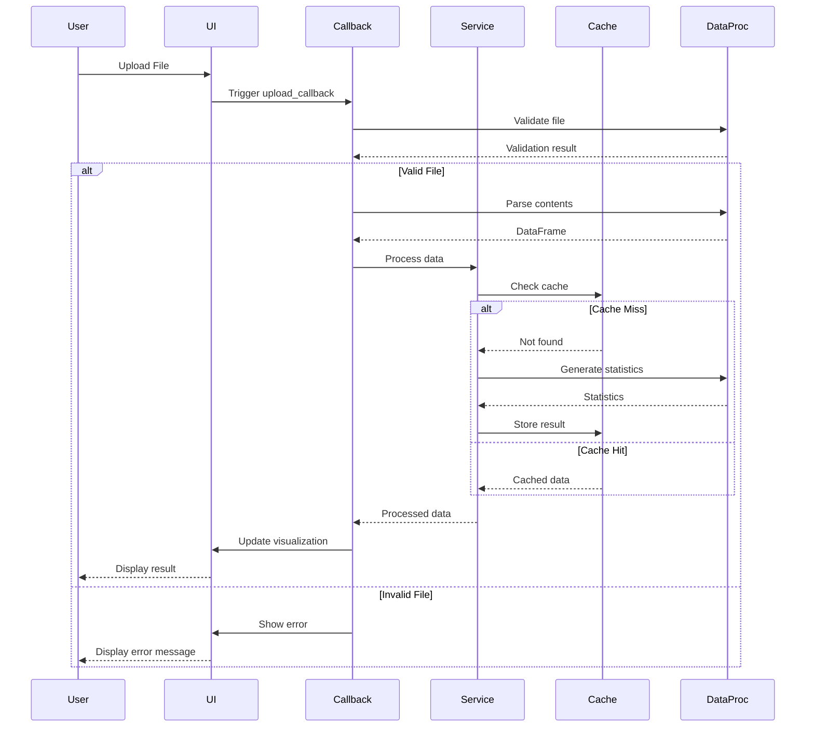
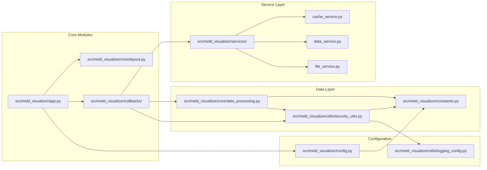
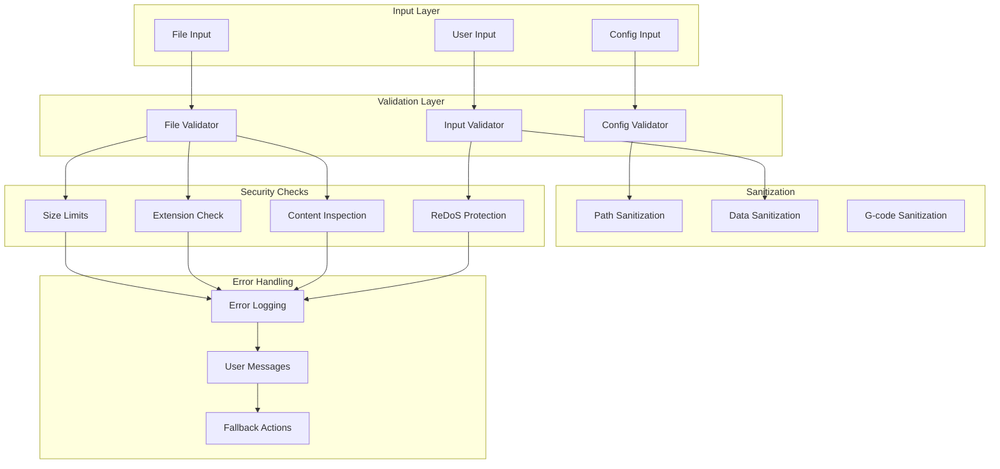
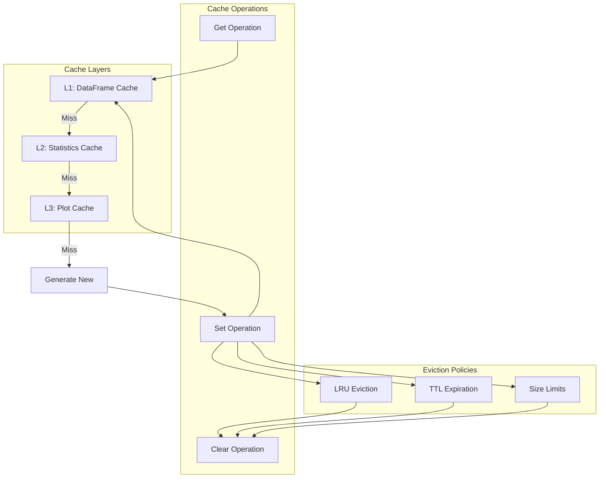
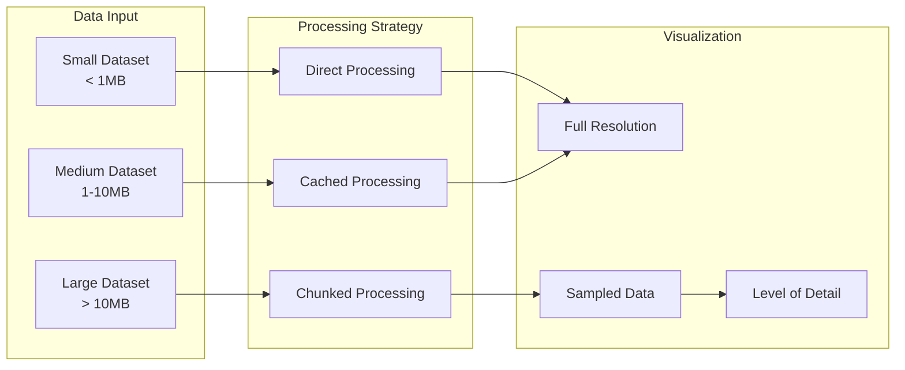
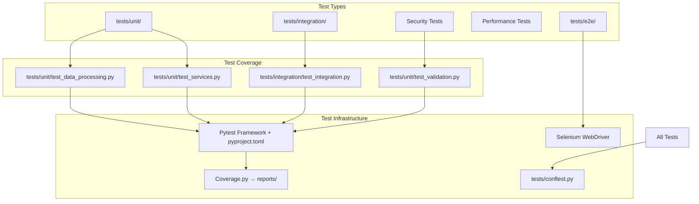
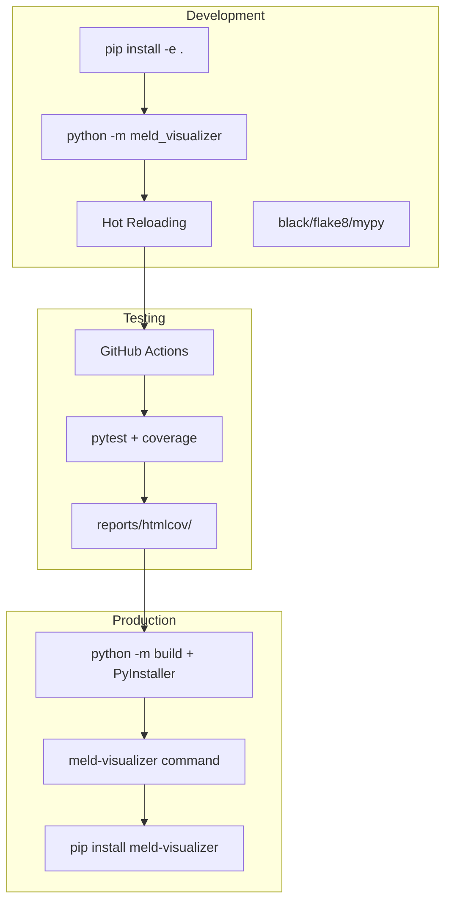

# MELD Visualizer Architecture Documentation

## System Architecture



## Data Flow Diagram



## Component Interaction Diagram



## Module Dependencies



## Security Architecture



## Caching Strategy



## Performance Optimization Flow



## Testing Architecture



## Deployment Architecture



## Feedstock Geometry and Volume Calculation Architecture

### Corrected Volume Mesh Generation

The MELD Visualizer has been updated with mathematically correct feedstock geometry assumptions:

```mermaid
graph TB
    subgraph "Feedstock Geometry"
        SqRod[0.5" × 0.5" Square Rod]
        SqDim[12.7mm × 12.7mm]
        SqArea[161.3 mm² Cross-Section]
    end
    
    subgraph "Previous (Incorrect) Assumption"
        CircWire[Circular Wire Assumption]
        CircArea[~126.7 mm² Area]
        Error[21.5% Volume Underestimation]
    end
    
    subgraph "Volume Calculation Process"
        FeedVel[Feed Velocity]
        PathVel[Path Velocity]
        ConsMass[Conservation of Mass]
        BeadArea[Bead Cross-Section Area]
        VolMesh[3D Volume Mesh]
    end
    
    SqRod --> SqDim
    SqDim --> SqArea
    
    FeedVel --> ConsMass
    PathVel --> ConsMass
    SqArea --> ConsMass
    ConsMass --> BeadArea
    BeadArea --> VolMesh
    
    CircWire --> CircArea
    CircArea --> Error
```

### Mathematical Corrections

#### Volume Conservation Principle
```
Bead Area = (Feed Velocity × Feedstock Area) / Path Velocity

Where:
- Feedstock Area = 161.3 mm² (0.5" × 0.5" square rod)
- Previous incorrect area = 126.7 mm² (circular assumption)
- Improvement = 27% more accurate volume calculations
```

### Configuration Architecture

```mermaid
graph LR
    subgraph "Configuration System"
        Config[config.json]
        FeedType[feedstock_type]
        FeedDim[feedstock_dimension_inches]
    end
    
    subgraph "Feedstock Types"
        Square["square" (default)]
        Circular["circular" (legacy)]
    end
    
    subgraph "Calculations"
        SqCalc[Square: side²]
        CircCalc[Circular: π × (d/2)²]
    end
    
    Config --> FeedType
    Config --> FeedDim
    
    FeedType --> Square
    FeedType --> Circular
    
    Square --> SqCalc
    Circular --> CircCalc
```

### Data Processing Pipeline Updates

The volume mesh generation pipeline now includes:

1. **Feedstock Configuration Loading**: Reads geometry from config.json
2. **Type-Specific Area Calculation**: Square vs circular geometry
3. **Volume Conservation**: Mathematically correct bead area calculations
4. **Mesh Generation**: Accurate 3D volume representations
5. **Backward Compatibility**: Legacy wire variables maintained

### Performance and Accuracy Impact

- **Volume Accuracy**: 27% improvement in volume calculations
- **Material Flow**: Correct representation of feedstock consumption
- **Process Analysis**: More accurate process parameter relationships
- **Backward Compatibility**: Existing configurations continue to work