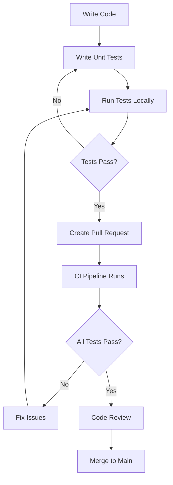

# MELD Visualizer Testing Strategy

## 🎯 Testing Philosophy

The MELD Visualizer testing strategy follows the **Test Pyramid** approach, emphasizing fast, reliable, and maintainable tests that provide confidence in the application's functionality across all layers.

### Core Principles

1. **Test Pyramid Distribution:**
   - 70% Unit Tests (Fast, Isolated, Focused)
   - 20% Integration Tests (Component Interactions)
   - 10% End-to-End Tests (Full User Workflows)

2. **Quality Gates:**
   - Minimum 75% code coverage
   - All tests must pass before merge
   - Performance benchmarks must be met
   - Security scans must pass

3. **Test-Driven Approach:**
   - Write tests first when adding new features
   - Maintain existing tests during refactoring
   - Use tests as living documentation

## 🏗 Test Architecture

### Layer 1: Python Unit Tests
**Purpose:** Validate individual functions and classes in isolation

**Coverage Areas:**
- Data processing algorithms
- Configuration management
- Service layer business logic
- Utility functions and helpers
- Error handling and edge cases

**Characteristics:**
- **Speed:** < 100ms per test
- **Isolation:** No external dependencies
- **Mocking:** Heavy use of mocks for external services
- **Coverage:** Target 90%+ for business logic

**Test Categories:**
```python
# Data Processing Tests
- CSV parsing and validation
- G-code interpretation
- Statistical calculations
- Data filtering and transformation
- Volume mesh generation

# Configuration Tests
- Theme management
- Environment variable handling
- Validation logic
- Default value handling

# Service Tests
- Cache operations
- File service functionality
- Data service workflows
- Error propagation
```

### Layer 2: Integration Tests
**Purpose:** Test component interactions and data flow

**Coverage Areas:**
- File upload → data processing pipeline
- Data processing → visualization rendering
- User interactions → state changes
- Multi-component workflows
- API integrations (if any)

**Characteristics:**
- **Speed:** 1-10 seconds per test
- **Scope:** Multiple components working together
- **Real Data:** Use realistic test datasets
- **Browser:** Playwright for UI interactions

**Test Scenarios:**
```javascript
// File Processing Integration
- Upload CSV → Parse → Validate → Display
- Upload G-code → Process → Visualize toolpath
- Large file handling → Progress indication

// UI Component Integration
- Filter controls → Graph updates
- Tab switching → Content rendering
- Theme changes → UI consistency
- Responsive behavior → Layout adaptation
```

### Layer 3: End-to-End Tests
**Purpose:** Validate complete user journeys

**Coverage Areas:**
- Critical user workflows
- Cross-browser functionality
- Accessibility compliance
- Error recovery scenarios

**Characteristics:**
- **Speed:** 30-120 seconds per test
- **Scope:** Full application workflows
- **Real Environment:** Production-like setup
- **Multiple Browsers:** Cross-browser validation

**User Journeys:**
```javascript
// Primary Workflows
1. New User Journey:
   - Open application
   - Upload first CSV file
   - Explore visualization
   - Export results

2. Power User Journey:
   - Upload multiple datasets
   - Apply complex filters
   - Switch between visualizations
   - Export filtered data

3. Error Recovery:
   - Handle invalid file uploads
   - Recover from network issues
   - Manage large file timeouts
```

## 🎨 Specialized Testing

### Performance Testing
**Objective:** Ensure application scales and performs within acceptable limits

**Metrics:**
- Page load time: < 3 seconds
- CSV upload processing: < 10 seconds for 100MB files
- Graph rendering: < 2 seconds for 10k points
- Memory usage: < 500MB for typical datasets

**Test Types:**
```python
# Load Testing
- Concurrent user simulation
- Large dataset processing
- Memory leak detection
- CPU usage monitoring

# Stress Testing
- Maximum file size handling
- Network bandwidth limitations
- Browser resource constraints
- Recovery from resource exhaustion
```

### Visual Regression Testing
**Objective:** Detect unintended UI changes

**Coverage:**
- Critical page layouts
- Graph rendering consistency
- Theme visual integrity
- Responsive design breakpoints

**Process:**
1. Capture baseline screenshots
2. Compare against current rendering
3. Flag differences above threshold (0.2%)
4. Manual review of flagged changes

### Security Testing
**Objective:** Identify and prevent security vulnerabilities

**Areas:**
- File upload validation
- Input sanitization
- Dependency vulnerability scanning
- Code security analysis

**Tools:**
- Bandit: Python code security
- Safety: Dependency vulnerability checking
- Semgrep: Static analysis
- NPM Audit: Node.js dependencies

## 🔄 Testing Workflow

### Development Phase


### Continuous Integration
1. **On Pull Request:**
   - Run unit tests
   - Run integration tests
   - Check code coverage
   - Run security scans
   - Generate test report

2. **On Merge to Main:**
   - Full test suite
   - Performance benchmarks
   - Cross-browser testing
   - Deploy to staging

3. **Nightly:**
   - Extended performance testing
   - Visual regression testing
   - Cross-platform testing
   - Security audit

### Test Data Management
**Strategy:** Layered approach with different data types for different test levels

**Static Test Data:**
- Small, controlled datasets for unit tests
- Realistic datasets for integration tests
- Edge case data for error testing

**Generated Test Data:**
- Property-based testing with Hypothesis
- Faker for realistic fake data
- Large datasets for performance testing

**Data Lifecycle:**
```python
# Test Data Hierarchy
tests/playwright/fixtures/test_data/
├── unit/
│   ├── minimal_data.csv (10 rows)
│   └── edge_cases.csv (invalid data)
├── integration/
│   ├── standard_dataset.csv (1000 rows)
│   └── complex_gcode.nc (realistic G-code)
└── performance/
    ├── large_dataset.csv (50k rows)
    └── stress_test_data.csv (100k+ rows)
```

## 📊 Quality Metrics

### Coverage Targets
- **Unit Tests:** 90% line coverage, 80% branch coverage
- **Integration Tests:** Cover all main user paths
- **E2E Tests:** Cover critical business workflows

### Performance Benchmarks
- **Unit Test Suite:** Complete in < 30 seconds
- **Integration Test Suite:** Complete in < 5 minutes
- **E2E Test Suite:** Complete in < 15 minutes
- **Full Suite:** Complete in < 30 minutes

### Quality Gates
```yaml
Pull Request Requirements:
- All tests pass
- Coverage >= 75%
- No security vulnerabilities
- Performance within benchmarks
- Code review approval

Release Requirements:
- Full test suite passes
- Visual regression tests pass
- Cross-platform compatibility verified
- Performance benchmarks met
- Security audit clean
```

## 🛠 Tools and Technologies

### Testing Frameworks
- **PyTest:** Python unit and integration testing
- **Playwright:** Browser automation and testing
- **Hypothesis:** Property-based testing
- **Factory Boy:** Test data generation

### CI/CD Tools
- **GitHub Actions:** Automated testing pipeline
- **Codecov:** Coverage tracking and reporting
- **Dependabot:** Dependency updates and security

### Monitoring and Reporting
- **Coverage.py:** Code coverage measurement
- **Pytest-html:** HTML test reports
- **Allure:** Advanced test reporting
- **Performance monitoring:** Custom metrics collection

## 🎯 Testing Best Practices

### Test Design
1. **AAA Pattern:** Arrange, Act, Assert
2. **Single Responsibility:** One test, one behavior
3. **Descriptive Names:** Test names should describe behavior
4. **Independent Tests:** No test dependencies
5. **Deterministic:** Same input, same output

### Code Organization
```python
# Good Test Structure
class TestDataProcessing:
    """Test suite for data processing functionality"""
    
    def test_csv_loading_with_valid_file_returns_dataframe(self):
        """Test that valid CSV files are loaded correctly"""
        # Arrange
        csv_path = "tests/fixtures/valid_data.csv"
        
        # Act
        result = load_csv_data(csv_path)
        
        # Assert
        assert isinstance(result, pd.DataFrame)
        assert len(result) > 0
        assert 'Date' in result.columns
```

### Maintenance
1. **Regular Review:** Monthly test suite health check
2. **Flaky Test Management:** Fix or remove unreliable tests
3. **Performance Monitoring:** Track test execution times
4. **Dependency Updates:** Keep testing tools current
5. **Documentation:** Keep testing docs up to date

## 🔍 Debugging and Troubleshooting

### Common Issues and Solutions

**Flaky Tests:**
- Use explicit waits instead of sleep
- Implement proper test isolation
- Mock external dependencies
- Use deterministic test data

**Performance Issues:**
- Profile slow tests
- Optimize test data setup
- Parallelize independent tests
- Use test markers to skip slow tests

**CI/CD Failures:**
- Check environment differences
- Verify test dependencies
- Review timing-sensitive tests
- Examine resource constraints

### Debug Strategies
```bash
# Local Debugging
pytest tests/python/unit/test_file.py::test_function -v -s --pdb

# Playwright Debugging
npx playwright test --debug --headed

# Performance Profiling
python -m pytest --profile-svg tests/python/unit/

# Coverage Analysis
pytest --cov --cov-report=html
```

## 📈 Future Improvements

### Short Term (1-3 months)
- Implement visual regression testing
- Add performance benchmarking
- Enhance cross-browser testing
- Improve test data management

### Medium Term (3-6 months)
- Add accessibility testing
- Implement chaos engineering
- Enhanced monitoring and alerting
- Test environment automation

### Long Term (6+ months)
- Machine learning for test optimization
- Automated test generation
- Advanced performance analytics
- Cross-device testing expansion

---

This testing strategy serves as a living document that should be reviewed and updated quarterly to ensure it continues to meet the project's needs and industry best practices.